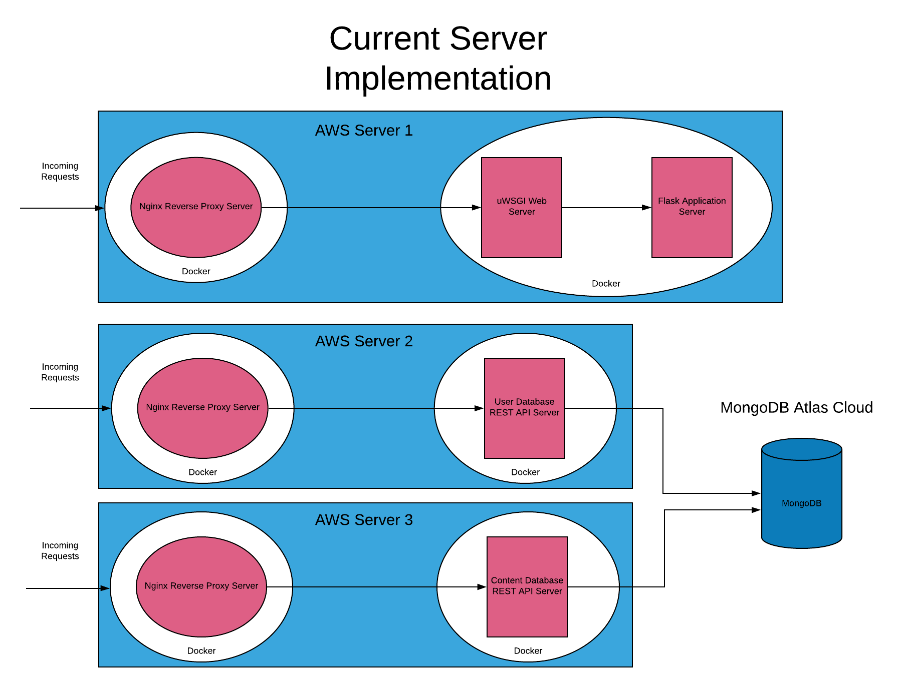

# Servers and Containerization



## Server Hosting Information

**Domain**
- crossley.tech
- nameservers hosted using cloudflare
- domain received from namecheap

**User Database Rest API**

* ec2 t2.micro instance, n.virginia, us-east-1b
* https://impressionist-user-db-api-east-1.crossley.tech (cbr22) (3.214.84.249 -> Elastic/Static IP)

**Content Database Rest API**

* ec2 t2.micro instance, n.virginia, us-east-1b
* https://impressionist-content-db-api-east-1.crossley.tech (crozariodev) (3.213.86.81  -> Elastic/Static IP)

**Application Server**

* ec2 t2.micro instance, n.virginia, us-east-1c
* https://impressionist-application-east-1.crossley.tech (hks32) (3.91.111.9 -> Elastic/Static IP)

## Docker 

### Installing Docker and Docker Compose on Ubuntu Server
https://docs.docker.com/install/linux/docker-ce/ubuntu/

```bash
sudo apt-get remove docker docker-engine docker.io containerd runc

sudo apt-get update

sudo apt-get install \
    apt-transport-https \
    ca-certificates \
    curl \
    gnupg-agent \
    software-properties-common

curl -fsSL https://download.docker.com/linux/ubuntu/gpg | sudo apt-key add -

sudo add-apt-repository \
   "deb [arch=amd64] https://download.docker.com/linux/ubuntu \
   $(lsb_release -cs) \
   stable"

sudo apt-get update

sudo apt-get install docker-ce docker-ce-cli containerd.io docker-compose

```

## Server Setup using Docker 

**run initial tls certificate website**

```
cd initial-tls-certificate

sudo mkdir -p /docker/letsencrypt-docker-nginx/src/letsencrypt/letsencrypt-site

sudo cp docker-compose.yml /docker/letsencrypt-docker-nginx/src/letsencrypt/

sudo cp nginx.conf /docker/letsencrypt-docker-nginx/src/letsencrypt/

sudo cp letsencrypt-site/index.html /docker/letsencrypt-docker-nginx/src/letsencrypt/letsencrypt-site/

cd /docker/letsencrypt-docker-nginx/src/letsencrypt

sudo docker-compose up -d

```

**staging a certificate (fake generate a certificate)**

```
# rename <SERVER URL>

sudo docker run -it --rm \
-v /docker-volumes/etc/letsencrypt:/etc/letsencrypt \
-v /docker-volumes/var/lib/letsencrypt:/var/lib/letsencrypt \
-v /docker/letsencrypt-docker-nginx/src/letsencrypt/letsencrypt-site:/data/letsencrypt \
-v "/docker-volumes/var/log/letsencrypt:/var/log/letsencrypt" \
certbot/certbot \
certonly --webroot \
--register-unsafely-without-email --agree-tos \
--webroot-path=/data/letsencrypt \
--staging \
-d <SERVER URL>

# get more information

sudo docker run --rm -it --name certbot \
-v /docker-volumes/etc/letsencrypt:/etc/letsencrypt \
-v /docker-volumes/var/lib/letsencrypt:/var/lib/letsencrypt \
-v /docker/letsencrypt-docker-nginx/src/letsencrypt/letsencrypt-site:/data/letsencrypt \
certbot/certbot \
--staging \
certificates

#removes staging files

sudo rm -rf /docker-volumes/
```

**generating an actual certificate**
```
# replace EMAIL and <SERVER URL>
# generates the certificate onto local machine folder /docker-volumes ... 

sudo docker run -it --rm \
-v /docker-volumes/etc/letsencrypt:/etc/letsencrypt \
-v /docker-volumes/var/lib/letsencrypt:/var/lib/letsencrypt \
-v /docker/letsencrypt-docker-nginx/src/letsencrypt/letsencrypt-site:/data/letsencrypt \
-v "/docker-volumes/var/log/letsencrypt:/var/log/letsencrypt" \
certbot/certbot \
certonly --webroot \
--email crozariodev@gmail.com --agree-tos --no-eff-email \
--webroot-path=/data/letsencrypt \
-d <SERVER URL>

# stop server 

sudo docker-compose down
```

**generate dh param key**

```
sudo apt-get -y install openssl

sudo mkdir -p dh-param

sudo openssl dhparam -out ./dh-param/dhparam-2048.pem 2048
```

**run docker containers/services for the server**

```
sudo docker-compose up -d
```

**add a cron job to renew tls certificate**
```
sudo crontab -e

# add to end of cron file
0 23 * * * docker run --rm -it --name certbot -v "/docker-volumes/etc/letsencrypt:/etc/letsencrypt" -v "/docker-volumes/var/lib/letsencrypt:/var/lib/letsencrypt" -v "/docker-volumes/data/letsencrypt:/data/letsencrypt" -v "/docker-volumes/var/log/letsencrypt:/var/log/letsencrypt" certbot/certbot renew --webroot -w /data/letsencrypt --quiet && docker kill --signal=HUP nginx-reverse-proxy
```


### Useful Docker Commands

**run docker compose**
```
docker-compose up -d
```

**stop docker compose**
```
docker-compose down
```

**build docker to an image**
```
docker build -t <username>/<project-name> . 

docker build -t crozario/impressionist-application-server .
``` 

**run docker image -d -> detach mode, -e "ENV=production" -> environment variable, -p 3000:3000 -> port mapping, first port is actual computer, second port is docker container's, -it -> shows stdout with tty, interactive**
```
docker run

docker run -d -p 3000:3000 crozario/impressionist-application-server
``` 

**get running docker processes**
```
docker ps 
``` 

**removes all images that are not running**
```
docker system prune -a
``` 

**print output of application**
```
docker logs <container id>
``` 

**stop all containers**
```
docker kill $(docker ps -q)
```

**remove all containers**
```
docker rm $(docker ps -a -q)
``` 

**remove all docker images**
```
docker rmi $(docker images -q) 
``` 

**run bash inside docker conatiner to expore container state**
```
docker exec -t -i <container id> /bin/bash
``` 

**rebuild a specific service on docker-compose before running**
```
docker-compose up --no-deps --build <service_name>
``` 

**Resources**

- https://www.humankode.com/ssl/how-to-set-up-free-ssl-certificates-from-lets-encrypt-using-docker-and-nginx (docker server setup with HTTPS)
- https://github.com/nodejs/docker-node/blob/master/docs/BestPractices.md (running node with docker best practices)
- https://docs.docker.com/compose/compose-file/ (docker compose)


## HTTPS

**Let's Encrypt and CertBot**
- To enable HTTPS on your website, you need to get a certificate (a type of file) from a Certificate Authority (CA) like Let' Encrypt.
    1. prove to CA that server controls the domain.
    2. request, renew and revoke certificated for the domain.

- Certbot supports the ACME protocol and will be used to automate certification.

**Resources**
https://letsencrypt.org/getting-started/
https://letsencrypt.org/how-it-works/

https://security.stackexchange.com/questions/5126/whats-the-difference-between-ssl-tls-and-https
https://expressjs.com/en/advanced/best-practice-security.html
https://letsencrypt.readthedocs.io/en/latest/using.html#running-with-docker

## Nginx

- Will be used as the frontend web server for all servers.
- Used as a Reverse proxy (https://docs.nginx.com/nginx/admin-guide/web-server/reverse-proxy/)


**Useful Tools**
- curl
- seige (load testing web servers -> https://www.linode.com/docs/tools-reference/tools/load-testing-with-siege/) 


**research later**
https://success.docker.com/article/networking
https://www.digitalocean.com/community/tutorials/understanding-nginx-server-and-location-block-selection-algorithms

## Flask


**Resources**
https://docs.nginx.com/nginx/admin-guide/web-server/app-gateway-uwsgi-django/
https://flask-socketio.readthedocs.io/en/latest/
